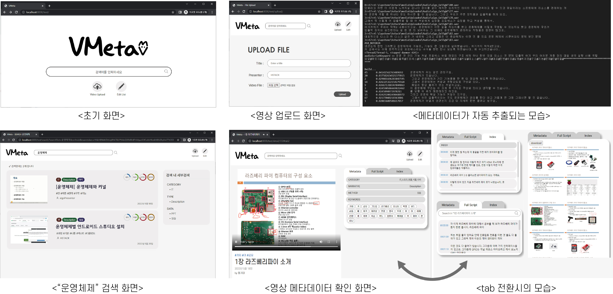

# 영상 메타데이터 자동 구축•재생 시스템 VMeta

Video Meta System (이하 VMeta)는 영상의 메타데이터를 자동으로 구축해 사용자에게 세밀하고 용이한 검색을 가능하게 하는 시스템이다. 
<br/><br/>

---
<br/>

## 🏆 수상 내역

### 2022 한성대학교 컴퓨터공학부 캡스톤디자인 작품 발표회

|  |
| --- |
| 모바일부문 최우수상 (1위) |

<br/>

---
<br/>

## 📷 소개 영상

하단 이미지를 클릭하시면 영상을 시청하실 수 있습니다:)

[](https://youtu.be/-k8TcLdf65s)

---
<br/>

## 📌 작품 소개

```
💡 VMeta는 영상의 메타데이터를 자동으로 구축 및 재생하는 웹 기반 시스템입니다.
```

### 1. 프로젝트 정의

  본 프로젝트는 영상을 실시간으로 분석해 영상의 속성을 반영하는 풍부한 메타데이터를 생성하여, 사용자에게 세밀하고 용이한 검색을 가능하게 하는 시스템 VMeta를 개발한다. VMeta는 음성인식 기술로 영상에서 음성을 텍스트로 자동 추출하고 OpenCV와 딥러닝 기술을 통해 각 프레임에서 정보를 추론한다. 이를 통해 영상의 키워드, 주요 구간, 주제 등 13개의 메타데이터를 생성하고 데이터베이스에 저장한다. 본 프로젝트는 Django를 이용하여 웹 서비스로 구현되었다.

  사용자가 본 프로젝트에서 개발한 VMeta에 영상을 업로드하면 세밀한 메타데이터가 자동으로 구축된다. 시스템은 내부의 랭킹 알고리즘을 통해 사용자가 검색한 영상을 정확도 순으로 제공할 뿐만 아니라 강의 동영상을 PPT로 변환하여 제공한다. 검색한 영상에 대한 모든 메타데이터를 바탕으로 사용자는 긴 영상에서 원하는 시간 지점을 빠르게 찾고 쉽게 청취할 수 있다.
  
<br/>

### 2. 프로젝트 배경

  여러 동영상 플랫폼의 성장, 코로나로 인한 온라인 강의 전환 등으로 인해 영상의 양이 증가하고 영상의 검색량 또한 증가했다. 그로 인해 영상 검색의 정확도가 떨어지는 문제가 생겼고, 정확한 영상 검색을 위한 기술이 필요해졌다.

  사용자의 영상 검색은 두 가지의 의도를 가진다. 보고자 하는 영상을 찾거나, 영상 내에서 장면을 검색하고자 할 때이다. 이를 바탕으로 검색의 정확성을 높이고 영상 속에서 원하는 부분을 쉽고 빠르게 찾을 수 있는 시스템을 구축하고자 한다.

<br/>

### 3. 프로젝트 목표

- **정확한 영상 검색**

  핵심어 추출을 기반으로 키워드 일치 순으로 결과를 정렬한다.   
  자동 추출된 메타데이터를 바탕으로 다양한 세부 검색을 제공하여 빠르고 정확한 정보를 얻을 수 있다.
  
    
- **쉬운 장면 검색**
    
  OpenCV와 STT를 활용하여 키워드와 스크립트를 추출한다.  
  이를 활용해 타임스탬프와 목차를 제공하고 영상 내에서 장면 검색이 가능하다.
    

<br/>
<br/>

---

<br/>

## ⚙️ 시스템 구조

### 전체 구조

   

<br/>
<br/>
<br/>
<br/>

### Ranking 알고리즘

   
    
<br/>
<br/>

---

<br/>

## 🔧 적용 기술

### 개발 환경

- Windows10, Linux 20.04 LTS

### 개발 도구

- Visual Studio Code, Django, MySQL

### 개발 언어

- Python, HTML, CSS, JavaScript, SQL

### 핵심 기술

- Django Framework, OpenCV, Tensorflow, FFmpeg


<br/>
<br/>

---

<br/>

## 🖼 프로젝트 결과

### 1. 작품 사진
   
   
<br/>

### 2. 기대 효과

- 본 프로젝트의 영상 메타데이터 자동 생성 기술을 e-learning, 동영상 플랫폼 등에 적용 가능
- 본 프로젝트의 소프트웨어를 대학이나 동영상 플랫폼에 즉각 활용 및 상용화 가능
- 사용자가 원하는 영상을 정확도 순으로 정렬하여 제공
- 사용자에게 영상 내에서 원하는 시점과 장면 검색을 용이하게 함

<br/>
<br/>

---

<br/>

## 📖 참고자료
- 음성 처리 기술 : ETRI. 2021. ETRI 음성처리기술. https://aiopen.etri.re.kr/# (2022)

- 한국어 전/후처리 : KoNLPy. 2022. KoNLPy. https://github.com/konlpy/konlpy (2022)

- Background task : ParthS007. 2021. background. https://github.com/ParthS007/background/releases/tag/v0.2.1 (2022)
